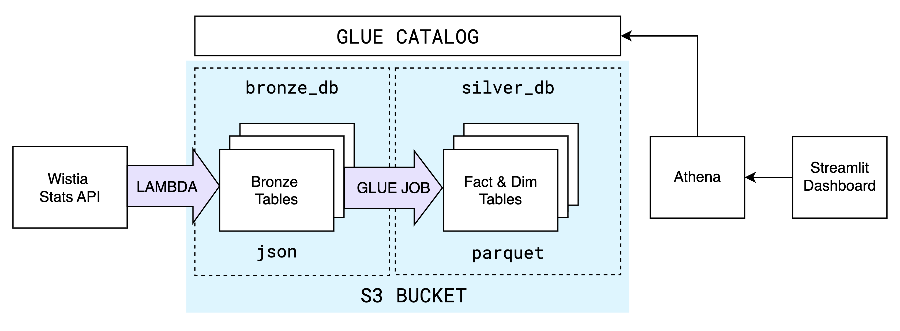

# Wistia Video Analytics Pipeline

## Business goal

Analyze video engagement performance tracking data from Wistia Stats API to enable insights to improve marketing strategies.

Sources:

* Event analytics from Wistia Stats API
* Media metadata from Wistia API

Outputs:

* `dim_media` - grain: media_id
* `dim_dates` - grain: date_id
* `dim_visitors` - grain: visitor_id
* `fct_events` - grain: media_id, visitor_id, created_at
* `fct_media_engagement` - grain: media_id, visitor_id, date

## Architecture


#### **Storage layout**

* Directories in S3 bucket
  * `data/raw/`: landing area for data ingested from Wistia API stored as JSON files
  * `data/curated/`: parquet files registered as external tables in Glue
  * `state/`: json file tracking watermark for incremental ingestion
* Glue Data Catalog databases
  * `raw`: landing/staging tables registered over raw JSON
  * `curated`: parquet fact & dimension tables used for analytics

#### **Ingestion**

* Lambda function `wistia_to_s3` ingests incrementally from Wistia Stats API
  * Authenticates to Wistia API via token stored in AWS Secrets Manager
  * Incrementally extract data via Wistia Stats API, paginates to fetch all pages
    * Media metadata (title, ID, hashed_id, created_at, etc.)
    * Engagement metrics (plays, play rate, watch time, etc.)
    * Visitor-level data (IP, engagement events)
  * Implements incremental ingestion based on created_at/updated_at
  * Implements retries with backoff for API requests
  * Loads extracted data into S3 raw landing zone w/ added metadata columns

#### **Glue ETL Jobs**

* Job: Incrementally processes raw JSON data using PySpark and updates curated tables in Glue Data Catalog

#### **Orchestration**

* EventBridge scheduled rule triggers Step functions workflow (including lambda + Glue ETL job) once a day

#### **Consumption**

* Athena queries the curated Glue Catalog tables, which implement the dimensional data model described below

## Execution
- (One-time setup) Execute DDL generated by `setup/create_tables.py` in Athena to create tables in Glue Data Catalog
- Execute pipeline via Step Functions (see Appendix below)
- Run parameters for Lambda function:
  - `--PIPELINE_MODE` (`full` or `incremental`)
  - `--PERSIST_STATE` (`true` or `false`) - update state checkpoint
- Lambda function outputs `start_date` and `end_date`
- Run parameters for Glue job:
  - `--PIPELINE_MODE` (`full` or `incremental`)
  - `--START_DATE` (`YYYY-MM-DD`, used when `--PIPELINE_MODE=incremental`)

## Project Files
```
.
├── .github
│   └── workflows
│       ├── ci.yml
│       └── cd.yml
├── infra
│   └── main.tf
├── ingest
│   ├── config.py
│   ├── lambda_function.py
│   ├── wistia_to_s3.py
│   ├── requirements-lambda.txt
│   ├── .env.example
│   └── local_run.py
├── jobs
│   ├── config.py
│   ├── main.py
│   └── run.py
├── setup
│   ├── create_tables.py
│   └── schemas.py
├── .env.example
├── job.sh
├── README.md
└── requirements.txt
```

- `setup/*` generates DDL to run in Athena to create external tables in Glue Data Catalog
- `ingest/*` defines the lambda function `wistia_to_s3` that incrementally ingests from Wistia API to `/raw` directory in S3
- `jobs/*` defines the glue pyspark job to build the curated layer of this pipeline
- `.github/worklows/*` defines continuous integration and deployment YAML for Github Actions
- `infra/main.tf` terraform script used to create lambda function, glue job, step function state machine, eventbridge scheduler, and IAM roles
- Additional files for local development
  - `.env` (see `.env.example`) - environment variables for local development and testing
  - `.job.sh` - scripts to run glue job locally using docker container for glue runtime

## Data Model
- `fct_media_engagement` (PK: media_id, visitor_id, date), play_count, total_watch_time, avg_watch_time_per_view, max_percent_viewed, avg_percent_viewed, updated_at
- `fct_events` (PK: media_id, visitor_id, created_at), date, percent_viewed, duration_viewed, updated_at
- `dim_media` (PK: media_id), title, media_url, duration, created_at, channel (Facebook, YouTube), updated_at
- `dim_visitors` (PK: visitor_id), ip_address, country, region, created_at, updated_at
- `dim_dates` (PK: date), month_num, month_name, week_of_year, year, day_of_week, day_of_week_name, day, is_weekday, updated_at

# Appendix
## Example Step Functions JSON
```json
{
  "Comment": "ws-ingest lambda -> ws-glue job",
  "StartAt": "IngestLambda",
  "States": {
    "IngestLambda": {
      "Type": "Task",
      "Resource": "arn:aws:states:::lambda:invoke",
      "OutputPath": "$.Payload",
      "Parameters": {
        "FunctionName": "wistia_to_s3",
        "Payload": {
          "pipeline_mode": "incremental",
          "persist_state": true
        }
      },
      "Next": "GlueJob"
    },
    "GlueJob": {
      "Type": "Task",
      "Resource": "arn:aws:states:::glue:startJobRun.sync",
      "Parameters": {
        "JobName": "ws-raw-to-curated",
          "Arguments": {
          "--PIPELINE_MODE": "incremental",
          "--START_DATE.$": "$.start_date"
        }
      },
      "End": true
    }
  },
  "TimeoutSeconds": 900
}
```
